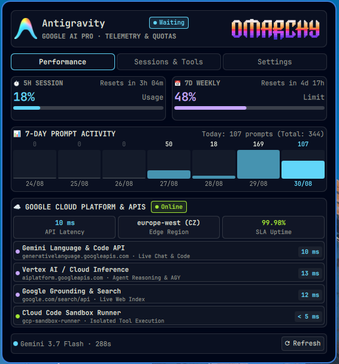
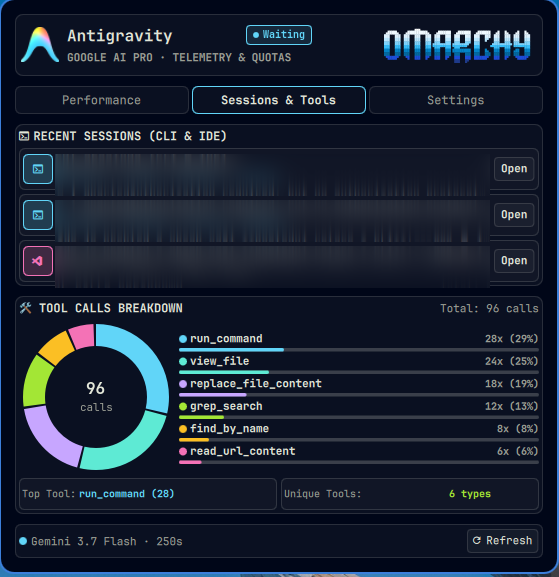
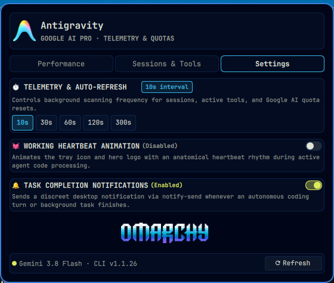

# 🚀 Antigravity 1.2 (Anti/Gem) for Omarchy Linux

A native, high-performance telemetry dashboard, subagents monitor, and quota tracker for **Google Antigravity** and **Gemini AI**, built for **Omarchy Linux** (Quickshell / Hyprland).

<p align="center">
  
</p>

Designed following the visual language, palette tokens, and 3-tab UX structure of **System Monitor** (`bitr0t.system-monitor`).

---

## 📸 Screenshots & Tabs

| ⚡ 1. Performance & Quotas | 📂 2. Sessions & Tools | ⚙️ 3. Settings & Controls |
| :---: | :---: | :---: |
|  |  |  |

---

## ✨ What's New in v1.2

* 🎨 **Adaptive System Theme Engine:** Full reactive synchronization with active Omarchy color themes (`colors.toml` / `FileView`). Subtle accent-tinted card backgrounds, borders, and controls matching Nord, Catppuccin, Tokyo Night, Gruvbox, and Wallhaven/Aether.
* 🇺🇦 **Full Ukrainian Localization (`uk` / `🇺🇦 Українська`):** 100% complete translations across all 3 tabs, tools, quotas, and subagents fleet.
* 🤖 **Specialized Subagents Fleet & Local GPU Workers:** Live monitoring of autonomous subagents (`sec-auditor`, `qml-designer-reviewer`, `test-runner`, `doc-researcher`) and local GPU models (`qwen2.5-coder:7b`, `deepseek-r1:7b` via Ollama on NVIDIA RTX 3070).
* 🔄 **Decoupled Refresh & Animation Engine:** Hardware-accelerated rotating spinner (`RotationAnimator`) with responsive non-overflowing buttons and silent background polling.
* 🛡️ **Hardened Security & Privacy:** Strict `0700`/`0600` cache permissions, structured command execution without `shell=True`, and regex prompt sanitization.
* 🖥️ **Wayland IDE Session Restorer:** 1-click launcher bridging the language server binary and focusing Antigravity IDE workspaces under Wayland.

---

## 🌟 Core Features

### 1. 🖥️ Ultra-Minimalist Top Bar Presentation
* **Dimensions & Typography:** Scaled down to match surrounding system widgets (`Style.font.caption` / 10px, logo 10×10px).
* **Color:** Crisp white font (`#ffffff`) for maximum contrast and legibility.
* **Live Heartbeat Telemetry:** Dual-stage organic heartbeat animation (105ms systole, 115ms diastole, echo and relaxation) active **exclusively** while the AI agent is thinking/working.
* **Instant Turn Completion:** Real-time 2s live polling detecting turn endings in the CLI transcript. Scale resets to 1.0 immediately when waiting for user input.

### 2. 📊 System Monitor Styled Main Dashboard Panel
* **PanelHero Header:** 40×40 px rounded icon, title `Antigravity`, metadata `GOOGLE AI PRO · TELEMETRY & QUOTAS`, live status badge (`WORKING` / `WAITING` / `IDLE`), and quick settings gear button.
* **Three Functional Navigation Tabs:**
  1. **Performance (`Performance`):**
     * 5-Hour Session Quota card with numerical readout and progress gauge in Electric Cyan (`#61d5f8`).
     * 7-Day Weekly Limit card with numerical readout and progress gauge in Lavender Purple (`#c7a6ff`).
     * 7-Day Prompt Activity Sparkline Chart (`Canvas` graph with grid lines, translucent gradient fill, and daily prompt points).
  2. **Sessions & Tools (`Sessions & Tools`):**
     * CLI and IDE session manager distinguishing terminal (`󰆍 CLI`) and IDE (`󰨞 IDE`) workspaces.
     * Direct 1-click **Open** launcher invoking `omarchy-launch-antigravity`.
     * Tool Calls breakdown meter bars showing agent usage distribution (bash, view_file, grep_search, edit, etc.).
  3. **Settings (`Settings`):**
     * Auto-refresh interval presets (`10s`, `30s`, `60s`, `120s`, `300s`) and custom seconds input with Save button.
     * Minimalist theme jumper switch (26×14 px) for enabling/disabling the working pulse.
     * Human heart rate BPM presets: **Sleep (40 BPM)**, **Rest (60 BPM)**, **Walk (85 BPM)**, and **Sprint (130 BPM)** + custom BPM input.
* **Bottom Status Bar:** Active AI model indicator, live sync countdown, and manual refresh button.

---

## 🎨 Color Palette & Design Tokens

| Token / Role | Hex Code | Purpose |
| :--- | :---: | :--- |
| **Primary Accent / CPU** | `#61d5f8` | 5h Session Quota, Graph Polyline, Active Tab |
| **Memory / Secondary** | `#c7a6ff` | 7-Day Weekly Quota Limit |
| **Upload / Live Working** | `#a3e635` | AI Working indicator and pulse heartbeat |
| **Download / Waiting** | `#5eead4` | Waiting for input status pill |
| **GPU / IDE Sessions** | `#f472b6` | Antigravity IDE session badges |
| **Top Bar Text** | `#ffffff` | Clean white percentage text in top bar |
| **Card Fill** | `rgba(text, 0.045)` | Subtle card background |
| **Card Border** | `rgba(text, 0.18)` | Subtle card outline |
| **Graph Grid** | `rgba(text, 0.12)` | Sparkline grid lines |

---

## 📦 Project Structure

```
omarchy-antigravity/
├── manifest.json                # Plugin definition & schema
├── Widget.qml                   # Main QML Bar Widget & Dashboard panel
├── assets/                      # Antigravity & Omarchy logos (PNG/SVG)
├── scripts/
│   └── antigravity_scanner.py   # High-performance telemetry scanner (< 25ms)
├── bin/
│   └── omarchy-launch-antigravity # Session restorer & workspace launcher
├── install.sh                   # Local 1-click installer
├── LICENSE                      # MIT License
└── README.md                    # Documentation
```

---

## 🚀 Installation & Usage

### Method 1: Using Omarchy Plugin Manager (Recommended)
```bash
omarchy plugin add https://github.com/simonezpx3/antigem-omarchy.git --enable
```

### Method 2: Manual Local Installation
1. Clone the repository and run the installer:
```bash
git clone https://github.com/simonezpx3/antigem-omarchy.git
cd antigem-omarchy
./install.sh
```
2. In `~/.config/omarchy/shell.json`, add `"simonez.antigem"` to `bar.layout.right`:
```json
{
  "id": "simonez.antigem",
  "pulseBpm": 60,
  "pulseEnabled": true,
  "refreshIntervalSec": 60
}
```
3. Reload the shell with `omarchy restart shell`.
