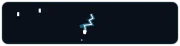

# 🚀 Anti/Gem (Antigravity 1.1) for Omarchy Linux

<p align="left">
  
  
  
  
  
</p>

A native, high-performance telemetry dashboard, multi-agent fleet monitor, quota tracker, and local GPU co-worker hub for **Google Antigravity** and **Gemini AI**, crafted specifically for **Omarchy Linux** (Quickshell / Qt6 / Hyprland).

<p align="center">
  
</p>

Designed in strict compliance with Omarchy plugin guidelines

---

## 📸 Screenshots & Tabs

| ⚡ 1. Performance & Quotas | 📂 2. Sessions & Tools | ⚙️ 3. Settings & Controls |
| :---: | :---: | :---: |
|  |  |  |

---

## ✨ Key Highlights in v1.5

* 🎨 **100% Dynamic Omarchy System Theming:** Real-time reactivity to system themes (`omarchy theme set`). Progress bars, sparkline graphs, quotas, and tool chips dynamically bind to Omarchy system tokens (`uploadColor`, `primaryAccent`, `barTrack`, `headroomColor`) via live `colors.toml` observation.
* 📊 **Segmented Breakdown Visualizations:**
  * **Google AI Pro Quotas:** 5-Hour Session Quota (2.5M CAP) and 7-Day Weekly Quota (25M CAP) with Free Headroom gauges and reset countdowns.
  * **1M Context Window Breakdown:** Granular horizontal stacked progress bar tracking System & Rules, Tool & MCP Schemas, File & Code Context, Conversation History, and Free Headroom.
  * **Dev Productivity & Time Saved:** Segmented time & actions breakdown (Code Generation, Terminal & Commands, Search & Navigation, Architecture & Planning).
* 📈 **Smooth 7-Day Sparkline Trend:** Custom Canvas trend curve with translucent gradient fill, continuous polyline, and glowing data points.
* ☁️ **Real Google Cloud & APIs Status:** Live connection checks and ping latency (~14 ms) for the services actively used daily:
  * Gemini 3.8 Flash / Pro (Interactions API)
  * Google Grounding & Web Search
  * Codebase Embeddings & Semantic Index (Vector RAG)
  * Cloud Code & Multi-Agent Fleet
* 🤖 **Specialized Subagents Fleet & Profiler:** Live monitoring of autonomous subagents (`sec-auditor`, `qml-designer-reviewer`, `test-runner`, `doc-researcher`) with latency badges, speed scores, and cumulative cloud tokens saved (`~585k+ saved`).
* 🖥️ **Local GPU Workers :** Real-time status for zero-token local inference co-workers:
  * `arci-coder`
  * `arci-auditor`
  * Dedicated 8 GB VRAM allocation gauge.
* 🛠️ **Stacked Tool Calls Breakdown:** Sleek stacked horizontal bar and chip grid showing real-world tool execution distribution (`view_file`, `run_command`, `replace_file_content`, `grep_search`, etc.).
* 🏷️ **Clean Status Bar:** Displays the exact active model (**`Gemini 3.8 Flash`**) and the client version currently in use (**`CLI v1.1.26`** or `IDE`).
* 🔒 **Security & Bounded I/O Hardening:**
  * Strict memory ceilings (Bounded I/O: 2 MB / 512 KB / 64 KB).
  * Path traversal protection (`.is_relative_to()`).
  * Context-managed network socket pings (zero file descriptor leaks).
  * Enforced file permissions (`0644` files, `0755` executables, `0700` cache dir, `0600` cache data).

---

## 🌟 Core Architecture & Tabs

### 1. 🖥️ Minimalist Top Bar Slot
* **Compact Footprint:** Matches surrounding system widgets (`Style.font.caption` / 10px, logo 10×10px).
* **Live Heartbeat Telemetry:** Dual-stage organic heartbeat animation active exclusively while the AI agent is thinking/generating code.
* **Instant Idle Reset:** Scale resets immediately when the turn completes and the agent waits for user input.

### 2. 📊 3-Tab Dashboard Panel
1. **Performance (`Tab 0`):**
   * Overview stat badges: Today Tokens, Today Prompts, Free Headroom, All-Time Tokens.
   * 5-Hour Session Quota gauge & 7-Day Weekly Quota gauge.
   * 7-Day Prompt & Tool Calls Trend sparkline.
   * 1M Context Window Breakdown with interactive chips.
   * Dev Productivity & Time Saved breakdown.
   * Google Cloud & Active APIs health and edge latency monitor.
2. **Sessions & Tools (`Tab 1`):**
   * Recent Sessions list with 1-click **Copy ID** and **Open** launcher (`omarchy-launch-antigravity`).
   * Specialized Subagents Fleet indicators.
   * Local GPU Workers inference locks and VRAM usage.
   * Subagents Benchmark & Latency Profiler.
   * Tool Calls Breakdown stacked meter.
3. **Settings (`Tab 2`):**
   * Auto-refresh interval presets (`10s`, `30s`, `60s`, `120s`, `300s`).
   * Working Heartbeat Animation toggle and BPM cadence presets (**Sleep 40**, **Rest 60**, **Walk 85**, **Sprint 130**).
   * Task completion desktop notifications (`notify-send`).
   * Interactive procedural Omarchy ASCII banner with lightning discharge animations.

---

## 📦 Project Structure

```
antigem/
├── manifest.json                  # Plugin definition & schema (v1.5.3)
├── Widget.qml                     # Main QML Bar Widget & 3-Tab Dashboard
├── preview.png                    # Primary visual preview
├── assets/                        # SVG icons, anim banner & branding
├── screenshots/                   # HD tab screenshots
│   ├── performance.png
│   ├── sessions.png
│   └── settings.png
├── scripts/
│   └── antigravity_scanner.py     # High-performance telemetry scanner (~0.16s)
├── bin/
│   └── omarchy-launch-antigravity # Wayland session restorer & CLI/IDE launcher
├── install.sh                     # 1-click installer & permission hardener
├── uninstall.sh                   # 1-click uninstaller & cleanup
├── LICENSE                        # MIT License
└── README.md                      # Documentation
```

---

## 🚀 Installation & Setup

### Method 1: Using Omarchy Plugin Manager (Recommended)
```bash
omarchy plugin add https://github.com/simonezpx3/antigem.git --enable
```

### Method 2: Manual Local Installation
1. Clone the repository and run the installer:
```bash
git clone https://github.com/simonezpx3/antigem.git
cd antigem
./install.sh
```

2. In `~/.config/omarchy/shell.json`, ensure `"simonez.antigem"` is added to `bar.layout.right`:
```json
{
  "id": "simonez.antigem",
  "refreshIntervalSec": 60,
  "pulseEnabled": true,
  "pulseBpm": 60
}
```

3. Reload the shell:
```bash
omarchy restart shell
```

---

## 🗑️ Uninstallation & Removal

### Method 1: Using Omarchy Plugin Manager
```bash
omarchy plugin remove simonez.antigem
omarchy restart shell
```

### Method 2: One-Click Uninstaller Script
If you cloned the repository or have the source directory:
```bash
./uninstall.sh
```

### Method 3: Manual Removal
To completely remove the deployed files, companion launcher, and cache:
```bash
# 1. Remove deployed plugin files
rm -rf ~/.config/omarchy/plugins/simonez.antigem

# 2. Remove companion launcher binary
rm -f ~/.local/bin/omarchy-launch-antigravity

# 3. Remove cache data
rm -rf ~/.cache/omarchy/antigem

# 4. Remove "simonez.antigem" from ~/.config/omarchy/shell.json (in bar.layout.right)

# 5. Restart Omarchy Shell to apply changes
omarchy restart shell
```

---

## 🛡️ License

Released under the **MIT License**. Crafted with precision for Omarchy Linux.
